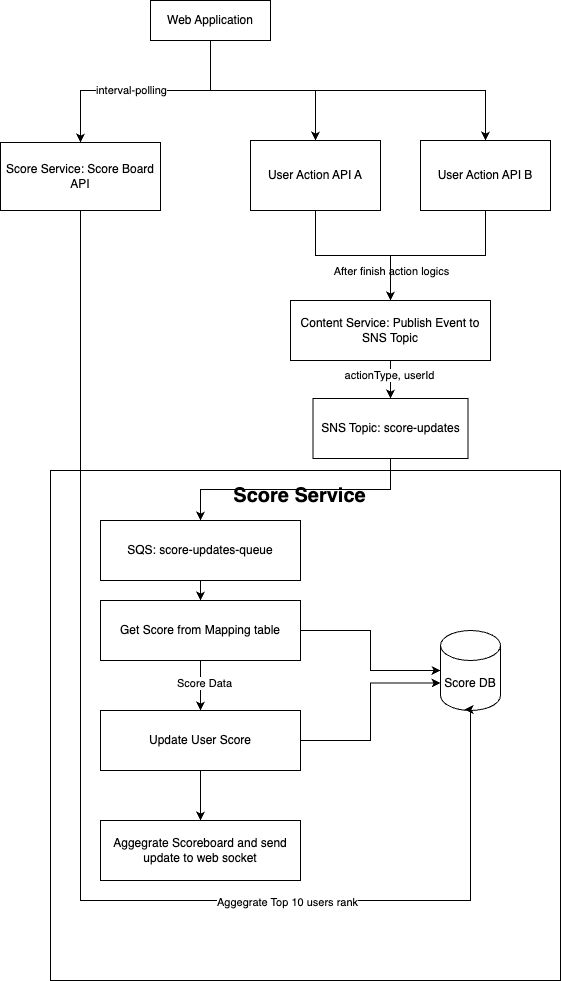

# API Service Specification: User Scoring Application
## 1. Overview and Architecture
This specification outlines the requirements for a User Scoring Application built using a Microservice Architecture and an Event-Driven Architecture (EDA) utilizing AWS SNS/SQS for asynchronous communication. The system is divided into two primary services: Content Service and Score Service.

| Component |	Technology/Platform	| Purpose |
| :------- | :------: | -------: |
| Backend Framework | NestJS  |    Utilized for efficient development of scalable microservices in TypeScript.|
| Database (Shared) |	PostgreSQL  |	Chosen for its reliability, transactional integrity, and extensibility. |
| Cloud Platform |	AWS (Amazon Web Services) |	Provides the core infrastructure, including messaging (SNS/SQS). |
| Frontend    |	ReactJS |	Client-side application for user interaction. |
| Messaging |	AWS SNS/SQS |   Asynchronous communication between Content and Score services. |

## 2. Service Implementation Guidelines
### 2.1. Content Service
The Content Service is responsible for managing user-generated content and associated actions. It acts as the event publisher for scoring events.

#### 2.1.1. Core Responsibilities
User Management: Handles user profiles and authentication (if not delegated to a separate service).

Content Management: Manages entities like posts, comments, and likes.

Event Publishing: Emits score-related events to the designated SNS topic upon successful completion of a scorable user action.

#### 2.1.2. Database Schema (Conceptual)
| Table | Purpose |	Key Columns (Conceptual) |
| :------- | :------: | -------: |
| User	| Stores user profile information.	| id, username, email, createdAt |
| Post	| Stores user-created posts.	| id, userId (FK), title, content, createdAt |
| Comment	| Stores comments on posts.	| id, userId (FK), postId (FK), text, createdAt |
| Like	| Stores user likes on content.	| id, userId (FK), contentId, contentType (e.g., 'Post', 'Comment'), createdAt |

#### 2.1.3. Scorable Actions API (Examples)
These APIs handle the business logic and must publish an event upon success.

| Action API (REST) | 	Description	| Expected Event actionType |
| :------- | :------: | -------: |
| POST /posts |	Create a new post.	| POST_CREATE |
| POST /comments |	Add a comment to a post.	| COMMENT_ADD |
| POST /likes |	Like a post or comment.	| CONTENT_LIKE |

#### 2.1.4. SNS Configuration and Event Structure
**SNS Topic:** Configure an AWS SNS Topic named score-updates (or similar, e.g., user-activity-events).

**Event Message:** The service must publish a JSON message to the score-updates topic containing the following mandatory fields:

| Field | 	Data Type |	Description | 	Example Value |
| :------- | :------ | :------- | :------- |
|userId |	string or integer |	The ID of the user whose score is being updated. |	12345 |
|actionType |	string	| A unique identifier for the action that triggers the score. Must map to the ScoreMapping table. |	POST_CREATE |
|timestamp |	ISO 8601 string |	The time the action was successfully recorded in the Content Service. |	2025-09-26T05:30:00Z |
|contentId |	string or integer |	(Optional) The ID of the content entity (Post, Comment, etc.). |	p9876 |

### 2.2. Score Service
The Score Service is the event subscriber and the single source of truth for user scores.

#### 2.2.1. Core Responsibilities
**Event Consumption:** Subscribes to the score-updates SNS topic via an SQS queue.

**Score Calculation:** Determines the score value for a given action and updates the user's total score.

**Score Persistence:** Maintains the current total scores and a history of all score changes.

**Scoreboard Generation:** Provides an API for querying the ranked user scores.

#### 2.2.2. Database Schema
Table |	Purpose	| Columns |	Constraints/Details |
| :------- | :------ | :------- | :------- | 
| Score |	Stores the current total score for each user. |	userId (PK), score (numeric), lastUpdatedAt (timestamp) |	userId must be unique. Update this table atomically with ScoreHistory.|
| ScoreHistory |	Stores a detailed ledger of all score adjustments. |	id (PK), userId (FK), actionType (string), scoreChange (numeric), timestamp (timestamp) |	Records the score delta for traceability. timestamp should come from the SNS message. |
| ScoreMapping |	Configurable mapping of action types to their score values.	|actionType (PK/string), scoreValue (numeric), description (string) |	Allows dynamic score changes without code deployment. Must be pre-populated.|

#### 2.2.3. Key Functions and Logic
Act as a SQS Listener (UpdateScores):

**Subscription:** Configure an AWS SQS Queue to subscribe to the score-updates SNS Topic.

**Processing:** Upon receiving a message:

A. Validate the message structure (presence of userId, actionType, timestamp).

B. Lookup: Query the ScoreMapping table using the received actionType to get the scoreValue.

C. Transaction: Execute a transaction that:

Updates the user's total score in the Score table (increment score by scoreValue, set lastUpdatedAt).

Inserts a new record into the ScoreHistory table using the userId, actionType, scoreValue (as scoreChange), and the event timestamp.

D. Acknowledge: Delete the message from SQS only upon successful transaction commitment. Implement proper dead-letter queue (DLQ) handling for failed processing.

**API Endpoint (ScoreboardAPI):**

|API (REST) |	Method |	Description	Return Structure (JSON) |
| :------- | :------ | :------- | 
|/scoreboard/top10 |	GET	| Retrieves the top 10 users ranked by total score.	[{ "rank": 1, "userId": "...", "score": 950, "username": "..." }, ...] |

#### 2.2.4. Scoreboard Implementation Details
**Query:** The API must perform a query that orders users from the Score table by score in descending order and limits the result to the top 10 (or a configurable limit).

**User Data:** The API should ideally fetch the corresponding username/display name from the Content Service (or a shared user store if available) to provide a meaningful result, or be configured to join with the User table if it's replicated/shared. 

**Instruction:** The backend team must decide on a strategy for fetching usernames (e.g., direct Content Service API call, local user cache, or an eventual consistency model).

**Polling Strategy:** The Frontend will implement an interval polling mechanism (e.g., every 3-5 seconds) to retrieve near real-time scoreboard data. The Score Service API latency must be optimized for this frequent access.

**Race Condition:** To prevent race condition possibly a user trigger score update via actions multiple time in short time period, block the writing on score table to avoid data inconsitency.

## 3. System Flow Diagram (Event-Driven)
This flow illustrates the user action to score update process.

1. User Action: Web application sends an API request (e.g., POST /posts) to the Content Service.

2. Logic & Persistence: Content Service validates the request, executes business logic, and persists the content data (e.g., in the Post table).

3. Event Publish: Content Service publishes a structured JSON message to the score-updates SNS Topic.

4. Message Queueing: The score-updates topic pushes the message to the configured Score Service SQS Queue.

5. Event Consumption: Score Service's SQS Listener polls and consumes the message.

6. Score Calculation: Score Service looks up the score value in the ScoreMapping table based on actionType.

7. Score Update: Score Service executes a transaction to:

    - Update the user's score in the Score table.

    - Insert a score change record into the ScoreHistory table.

8. Scoreboard Display (Separate Flow): Web application continuously calls the Score Service's Scoreboard API (GET /scoreboard/top10) to retrieve and display the ranked scores.

